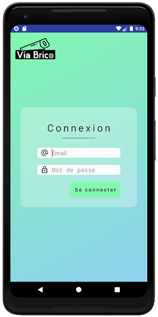
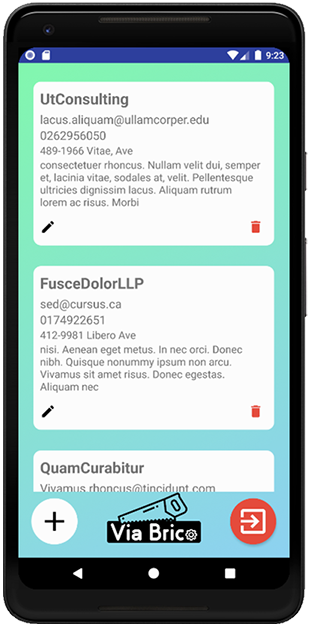
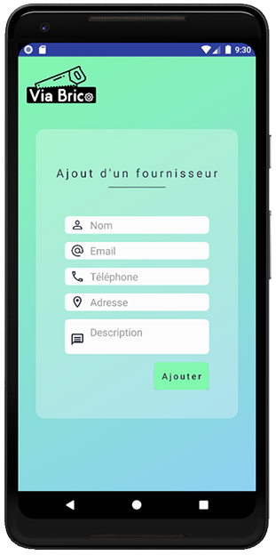

# Installation

To use the app, you have to install the `.apk` first.

# Usage - All pages of the application

 
Login Page             |  Provider List Page
:-------------------------:|:-------------------------:
  |  

Edit Provider Page             |  Adding Provider Page
:-------------------------:|:-------------------------:
  |  

After being connected, you can access to all providers of the enterprise.
You are allowed to add, edit and delete them as you want.

# Contributors 
### Here's the full list of the collaborators for this project
- [@adrienvaucard](https://github.com/adrienvaucard "Go to @adrienvaucard's Github")
- [@Kwoak](https://github.com/Kwoak "Go to @Kwoak's Github")
- [@MathisLeRoyNivot](https://github.com/MathisLeRoyNivot "Go to @MathisLeRoyNivot's Github")
- [@tanguy85](https://github.com/tanguy85 "Go to @tanguy85's Github")

